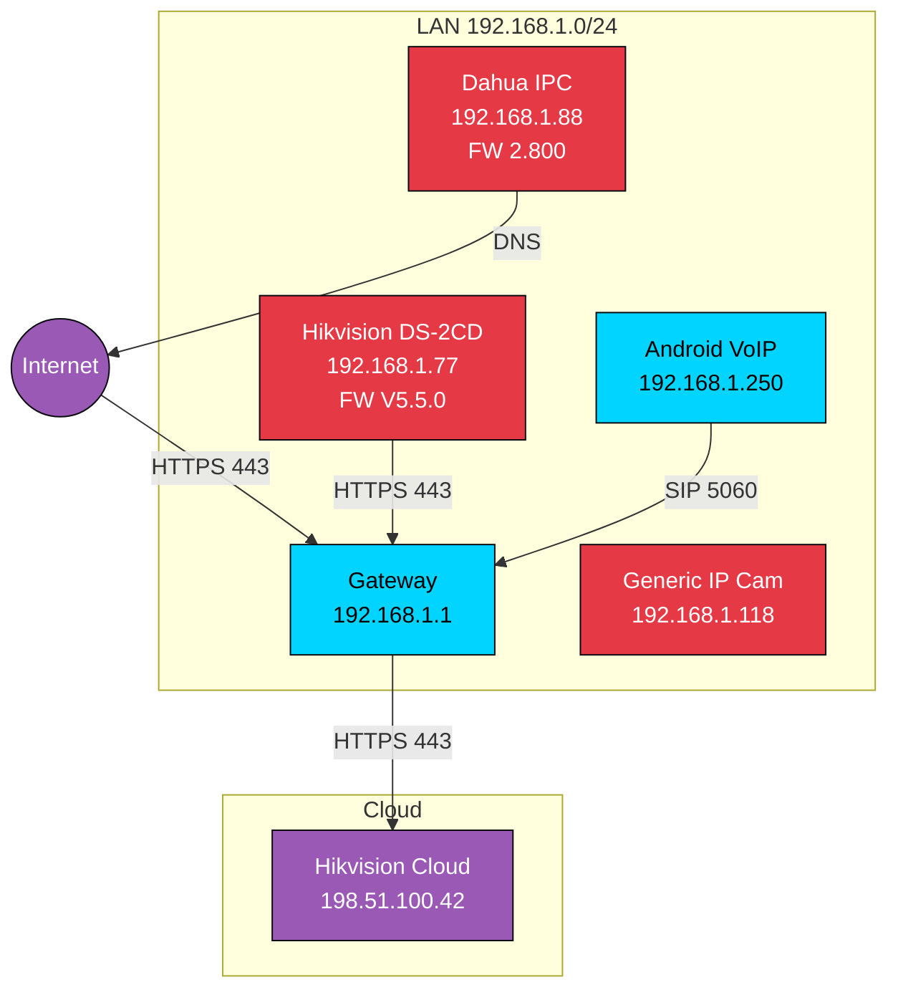

# 🔱 TUTORIAL 02 — CARTOGRAPHIER

## *Dessiner la cible avant de la toucher*

> *Une cible sans schéma est incompréhensible. Une attaque sans carte est une agression.*

**Série :** Protocole GHOST1O1
**Niveau :** Intermédiaire
**Durée :** 60-90 minutes
**Prérequis :** Avoir complété TUTORIAL 01 — OBSERVER

---

## 1. PHILOSOPHIE

Tu as **observé**. Tu as une liste de hosts, de ports, de services. Mais une liste, ce n'est pas une **carte**.

**Cartographier, c'est transformer une liste en compréhension.** C'est voir :
- Les **relations** entre les machines (qui parle à qui)
- Les **dépendances** logicielles (framework, libs, versions)
- Les **flux** de données (entrant, sortant, latéral)
- Les **utilisateurs** (humains, services, credentials)
- Les **zones** (DMZ, LAN, IoT, cloud)

**Pourquoi c'est critique :**
- Une attaque réussie exploite une **relation** (LAN lateral, trust, service-to-service)
- Une défense réussie protège une **relation** (microsegmentation, mTLS, zero trust)
- Sans la carte, tu rates 80% des chemins d'attaque possibles

**Ce que tu obtiens à la fin :** un schéma de la cible que tu peux montrer à un collègue et qu'il comprend en 30 secondes.

---

## 2. PRÉREQUIS

- TUTORIAL 01 complété (ou savoir faire un scan basique)
- Un lab de test ou un réseau autorisé
- Outils : `nmap`, `ghosteye` (optionnel), `quebec-ultimate` (optionnel), `draw.io` ou `mermaid` (pour le schéma)

---

## 3. THÉORIE

### Les 5 dimensions de la cartographie

**1. Topologie (QUI)**
```
Qui existe ? → Liste de hosts avec leur rôle
Qui parle à qui ? → Graphe de relations
```

**2. Surface (QUOI)**
```
Quels services ? → Ports, protocoles, versions
Quels flux ? → Entrant, sortant, latéral
```

**3. Dépendances (AVEC QUOI)**
```
Quels frameworks ? → Versions, CVEs associées
Quelles libs ? → Côté client, côté serveur
```

**4. Identités (QUI EST QUI)**
```
Quels utilisateurs ? → Humains, services, système
Quels credentials ? → Default, faibles, partagés
```

**5. Données (QUOI EN DEDANS)**
```
Quelles données sont stockées ? → DB, fichiers, secrets
Quelles données transitent ? → Plain, chiffré, sensible
```

### Outils de cartographie GHOST1O1

| Outil | Cible |
|-------|-------|
| `ghosteye` | Caméras IP, ONVIF, RTSP |
| `quebec-ultimate` | OSINT, ASN, domaines |
| `ycc365-ghost` | Firmware IoT, CVEs |
| `nmap` | Réseau générique |
| `maltego` (externe) | Graph viz avancé |
| `draw.io` (externe) | Schéma |

---

## 4. PRATIQUE

### Étape 1 — Récap de l'observation

Reprends ton dossier `~/mission_observer/` du tutoriel 01.

```bash
cd ~/mission_observer
cat 01_arp.txt
# 192.168.1.1   gateway
# 192.168.1.77  hikvision
# 192.168.1.88  dahua
# 192.168.1.118 generic
# 192.168.1.250 android
```

### Étape 2 — Relations et flux

```bash
# Capture longue (5 min) pour voir les flux naturels
sudo timeout 300 tshark -i eth0 -a duration:300 -w relations.pcap
tshark -r relations.pcap -q -z conv,ip | head -30
```

**Output type :**
```
Conversations IP
192.168.1.77:554  <-> 192.168.1.1:443    1500 packets
192.168.1.88:80   <-> 8.8.8.8:53         200 packets
192.168.1.250:5060<-> 192.168.1.1:5060   50 packets
```

**Interprétation :**
- 192.168.1.77 (Hik) parle au gateway en HTTPS (cloud sync)
- 192.168.1.88 (Dahua) résout du DNS via 8.8.8.8
- 192.168.1.250 (Android) fait du SIP

### Étape 3 — Cartographie ONVIF (avec ghosteye)

```bash
# Pour chaque caméra identifiée
for ip in 192.168.1.77 192.168.1.88; do
  echo "=== $ip ==="
  curl -s -X POST http://localhost:8082/onvif/probe \
    -H 'Content-Type: application/json' \
    -d "{\"ip\":\"$ip\"}" | python3 -m json.tool
done
```

**Output :**
```json
{
  "ip": "192.168.1.77",
  "manufacturer": "Hikvision",
  "model": "DS-2CD2142FWD-I",
  "firmware": "V5.5.0 build 210628",
  "serial": "DS-2CD2142FWD-I20210628",
  "hardwareId": "0x9c01"
}
```

→ Le **hardwareId** permet d'identifier le **SoC exact** (ici HiSilicon Hi3516).

### Étape 4 — Cartographie firmware (avec ycc365-ghost)

```bash
# Download firmware public
wget -O firmware.bin https://www.hikvision.com/firmware/V5.5.0.bin

# Analyse
python3 ../ycc365-ghost/scanner/firmware_meta.py firmware.bin | tee firmware_analysis.txt
```

**Output :**
```
[+] Firmware: Hikvision V5.5.0
[+] Architecture: ARM
[+] Binaries: 47
[+] Libraries: 
    - libcrypto.so.1.0.0 (OpenSSL 1.0.2k)
    - libwebsockets.so.3.0
[+] Default credentials found:
    - admin:12345
    - admin:(empty)
    - root:toor
[+] Hardcoded keys: 2 (RSA + AES)
[+] Known CVEs: CVE-2021-36260 (RCE), CVE-2017-7921 (auth bypass)
```

### Étape 5 — OSINT du réseau (avec quebec-ultimate)

```bash
# Pour comprendre d'où vient l'IP publique
curl ifconfig.me
# → 198.51.100.42 (ton IP publique)

python3 ../quebec-ultimate/quebec.py chain --ip 198.51.100.42 --depth 2
```

**Output :**
```
[+] IP: 198.51.100.42
[+] ASN: AS12345 — ISP-Fake-Example
[+] NetRange: 198.51.100.0/24
[+] Domains on this IP: 
    - example-iot-cloud.com
    - camera-update-server.io
[+] Other IPs in range: 15
[+] Contacts: abuse@isp.example (RFC compliant)
```

### Étape 6 — Le schéma (Mermaid)

Crée `cartographie.mmd` :



Visualisation : https://mermaid.live/

### Étape 7 — La matrice de risque

Crée `risk_matrix.md` :

| Host | Surface | Vulnérabilités | Risque | Notes |
|------|---------|----------------|--------|-------|
| 192.168.1.77 | HTTP/RTSP/SADP | CVE-2021-36260 RCE, CVE-2017-7921 auth bypass | 🔴 CRITIQUE | Accès root via ONVIF, default creds |
| 192.168.1.88 | HTTP/RTSP | CVE-2020-9520 hardcoded admin | 🟠 HAUTE | Default creds admin:admin |
| 192.168.1.118 | HTTP/RTSP | Firmware inconnu, no auth | 🟡 MOYEN | OEM générique, modèle à identifier |
| 192.168.1.1 | HTTP/HTTPS | Firmware routeur à check | 🟡 MOYEN | Gateway, impact si compromis = total |
| 192.168.1.250 | SIP | App VoIP publique | 🟢 BAS | Pas critique pour le scope |

---

## 5. PIÈGES

### Piège 1 : Oublier les services cloud

**Symptôme :** tu cartographies le LAN mais pas les endpoints cloud.

**Solution :** trace TOUS les flux sortants (HTTPS 443, MQTT 1883, custom) et identifie les destinations avec `whois`/`IP geo`.

### Piège 2 : Confondre "ports ouverts" et "surface exposée"

**Symptôme :** tu vois 10 ports ouverts mais tu rates que l'un d'eux est exposé via UPnP/DMZ.

**Solution :** vérifie la **port forwarding** et l'**UPnP** sur la gateway.

### Piège 3 : Pas de version = pas de CVE

**Symptôme :** tu n'arrives pas à matcher les CVEs.

**Solution :** utilise `nmap -sV --version-all` (plus agressif) ou compare les banners avec `searchsploit`.

### Piège 4 : Schéma trop complexe

**Symptôme :** ton schéma fait 50 nodes et personne ne le lit.

**Solution :** crée 2 niveaux :
- **Niveau 1** : macro (Internet → Gateway → LAN), lisible en 10 sec
- **Niveau 2** : détaillé (chaque host, chaque flux), pour l'investigation

### Piège 5 : Cartographier sans dater

**Symptôme :** la cible change, ton schéma est obsolète.

**Solution :** date chaque cartographie, refais un scan léger toutes les 24h en mission longue.

---

## 6. ALTERNATIVES

### Alternative A — Automatisé avec quebec-ultimate

```bash
python3 quebec.py chain --domain target.com --depth 3 --graph
# → Génère un fichier GraphML que tu peux ouvrir dans Gephi
```

### Alternative B — Maltego (commercial mais transformatif)

Si t'as accès à Maltego, il fait **80% du travail** pour toi. Les transforms sont chers mais pour une mission critique, ça vaut le coup.

### Alternative C — Cartographie manuelle à la main

Pour une cible simple (< 10 hosts), un **carnet papier** + une feuille A3 peut être plus rapide que de monter un outil.

---

## 7. TRANSMISSION

### 🎯 Mission

**Cartographie COMPLÈTE d'un petit réseau (5-15 hosts) avec schéma, matrice de risque, et identification d'au moins 1 chemin d'attaque.**

**Livrable :** `CARTOGRAPHIE.md` avec :
1. Schéma (Mermaid ou image)
2. Matrice de risque
3. Au moins 1 chemin d'attaque identifié (sans l'exécuter)
4. Recommandations de hardening

**Partage :** Discussions GHOST1O1 ou ton propre repo.

---

## 📚 Pour aller plus loin

- **TUTORIAL 03 — INSTRUMENTER** : la phase suivante
- **quebec-ultimate/README.md**
- **ghosteye/README.md**
- **ycc365-ghost/README.md**

---

<div align="center">

**L'ÉVEIL NOCTURNE** · [ghost1o1](https://github.com/187Ghost101) — 2026

*There is no lock. Du silence naît la lumière.*

</div>
